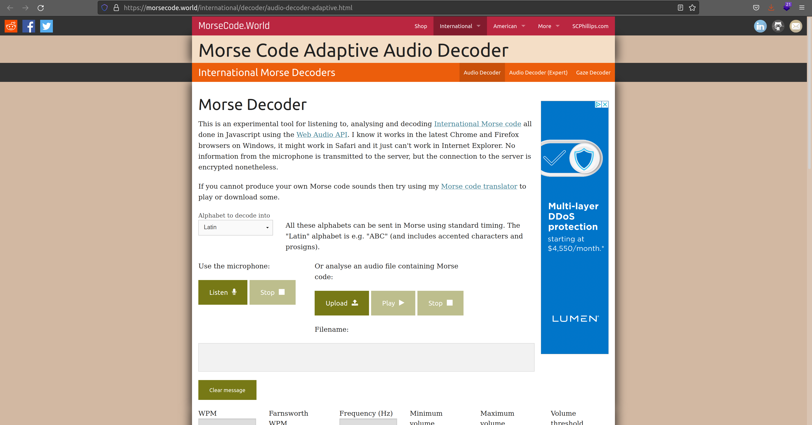
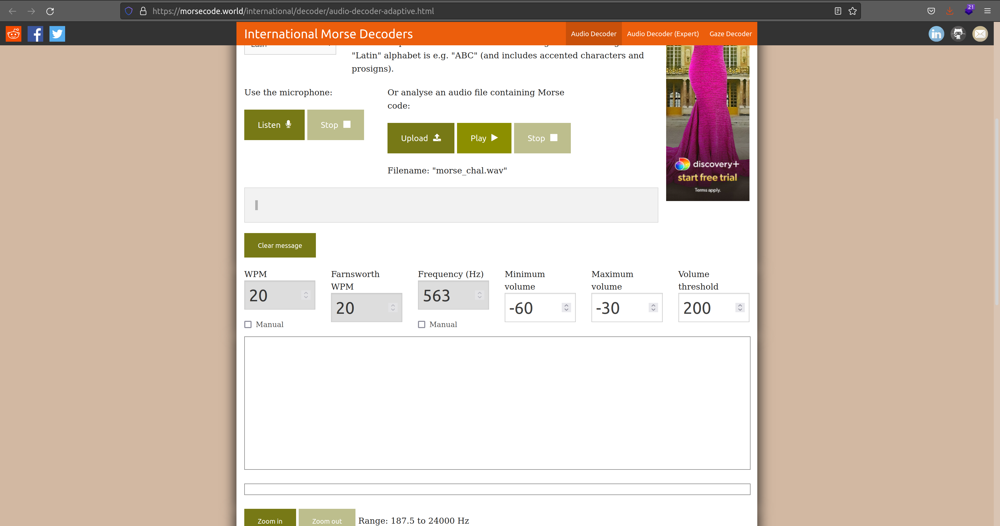
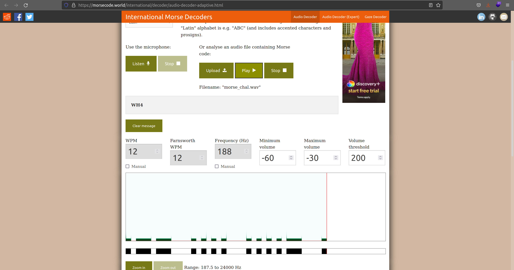
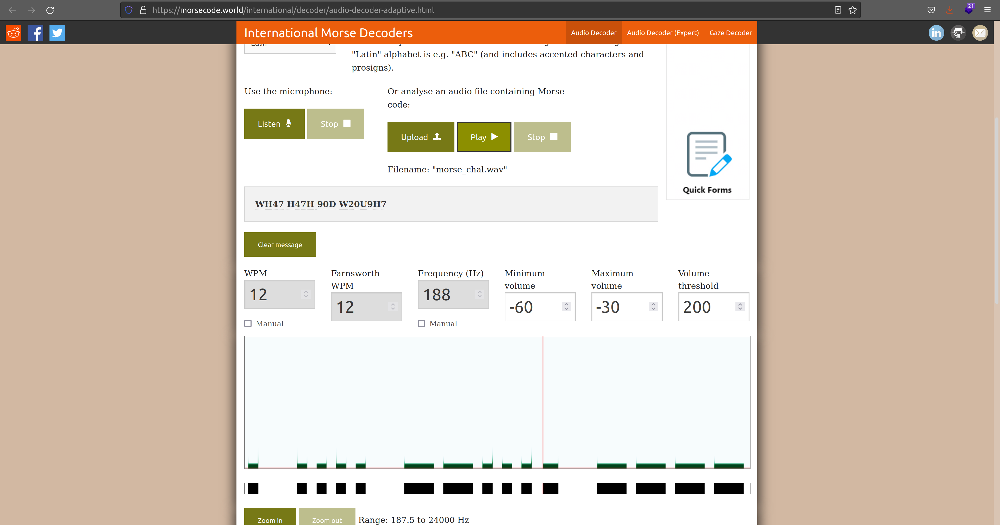

# **Challenge:** Morse Code


### **Category:** [Cryptography](../)
### **Point Value:** 100
### **Author:** WIL HONG
<br>

## **Description:**
Morse code is well known.<br> Can you decrypt this? Download the file [here](https://artifacts.picoctf.net/c/235/morse_chal.wav)[^1].[local](./morse_chal.wav)<br> Wrap your answer with picoCTF{}, put underscores in place of pauses, and use all lowercase.

# **Write-Up:**
Given the name of the challenge and listening to the sound file we can tell its morse code. Not knowing the code, I found this Online tool to translate from wav to morsecode text: [link](https://morsecode.world/international/decoder/audio-decoder-adaptive.html)<br>
  

First we upload our wav file to the site:  
  

Then by pressing play the site begins to decode the morse code message:  
  

After a short period of time we have our flag data:  


```
WH47 H47H 90D W20U9H7
```

Finally lets convert to picoCTF{} flag format
```
picoCTF{wh47_h47h_90d_w20u9h7}  
```  
# **FLAG:** 
```
picoCTF{wh47_h47h_90d_w20u9h7}  
```
[^1]: Included links to the source code may be out of date as they were what I recorded during the competition, and may be different now.