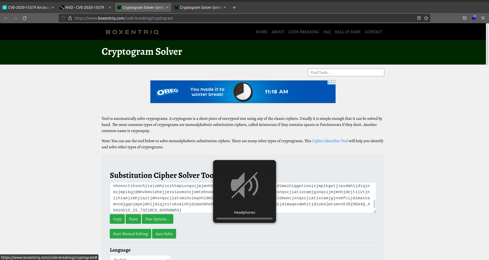

# **Challenge:** substitution2


### **Category:**
### **Point Value:**
### **Author:**
<br>

## **Description:**
It seems that another encrypted message has been intercepted. The encryptor seems to have learned their lesson though and now there isn't any punctuation! Can you still crack the cipher? Download the message [here](https://artifacts.picoctf.net/c/112/message.txt) [^1] [local](./message.txt).

# **Write-Up:**

Went through trying to write a [program](./solve.py) to do this solve but didnt know enough to be effective.

Found this [tool online](https://www.boxentriq.com/code-breaking/cryptogram)

Plugged in the cypher text:  
  

 And used the auto solve feature, we get this  
  

Looking at the solution we get this for the key:
```
key = 'rwuhajymetlgiofvmxpszkbcqd'
```
And looking at the end of the message we find our flag:

```
picoctf{n6r4m_4n41y515_15_73d10u5_6cf50b5c}
```
# **FLAG:** 
```
picoctf{n6r4m_4n41y515_15_73d10u5_6cf50b5c}
```

[^1]: Included links to the source code may be out of date as they were what I recorded during the competition, and may be different now.