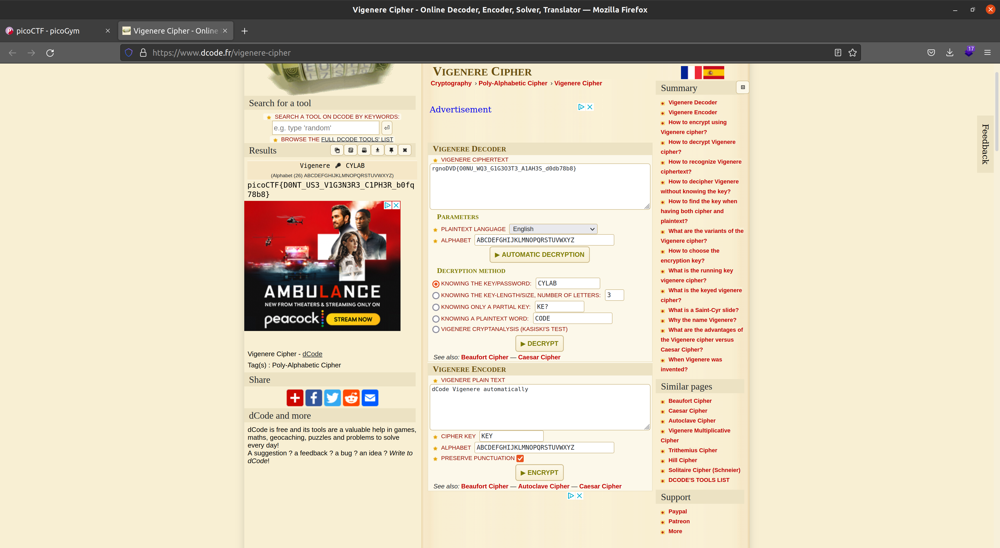

# **Challenge:** vigenere


### **Category:** Cryptography
### **Point Value:** 100
### **Author:** Mubarak Mikail
<br>

## **Description:**
Can you decrypt this message? Decrypt this [message](https://artifacts.picoctf.net/c/532/cipher.txt)[^1] [local](./cipher.txt) using this key "CYLAB".

# **Write-Up:**

Instead of writing my own I just [used](https://www.dcode.fr/vigenere-cipher) plugged in the known values and get the flag:


```
picoCTF{D0NT_US3_V1G3N3R3_C1PH3R_b0fq78b8}
```
# **FLAG:** 
```
picoCTF{D0NT_US3_V1G3N3R3_C1PH3R_b0fq78b8}
```

[^1]: Included links to the source code may be out of date as they were what I recorded during the competition, and may be different now.