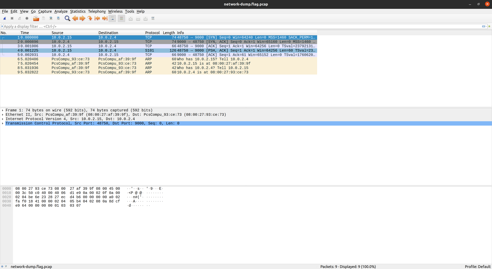
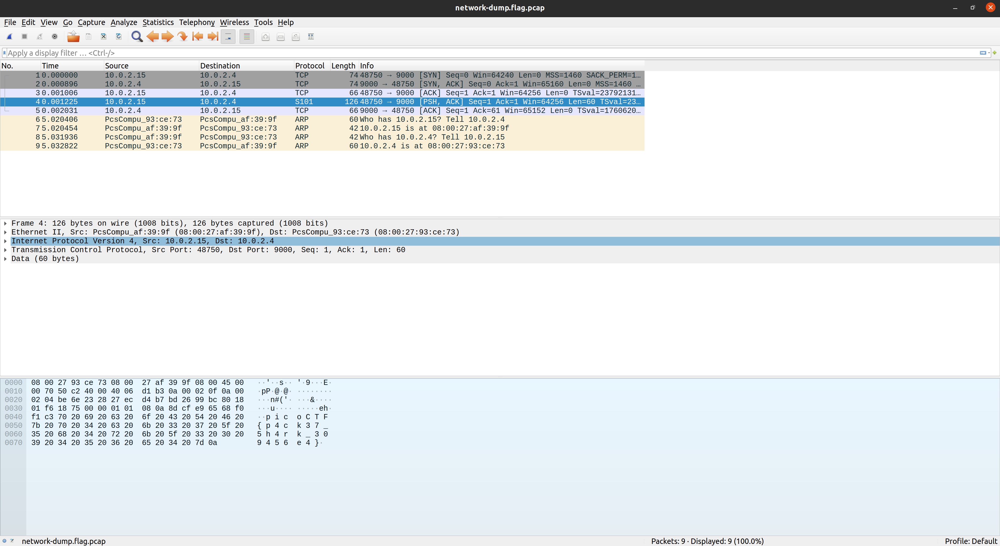

# **Challenge:** Packets Primer


### **Category:** [Forensics](../)
### **Point Value:** 100   
### **Author:**LT 'syreal' Jones
<br>

## **Description:**
Download the packet capture file and use packet analysis software to find the flag.<br>
<br>
Download packet [capture](https://artifacts.picoctf.net/c/204/network-dump.flag.pcap)[^1] [local](./network-dump.flag.pcap)


# **Write-Up:**
Opened the pcap file in wireshark and this is what we see:
  


Looking through the packets we see that packet 4 has the flag as plain text:
  


```
p i c o C T F { p 4 c k 3 7 _ 5 h 4 r k _ 3 0 9 4 5 6 e 4 }
```

Removing the extra whitespace:
```
picoCTF{p4ck37_5h4rk_309456e4}  
```
# **FLAG:** 
picoCTF{p4ck37_5h4rk_309456e4}

[^1]: Included links to the source code may be out of date as they were what I recorded during the competition, and may be different now.