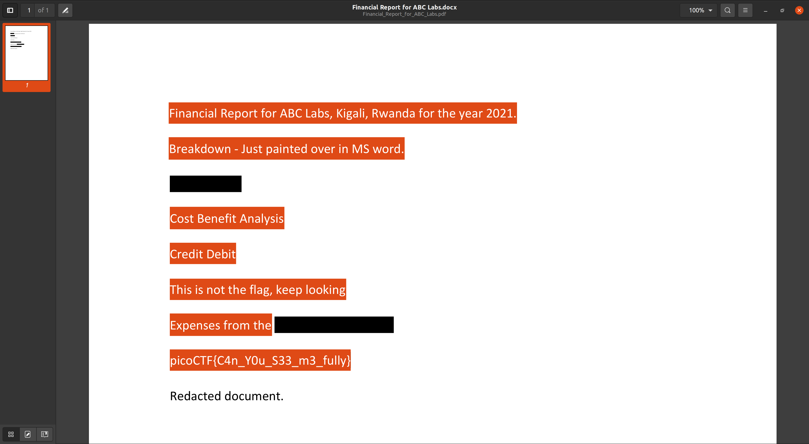

# **Challenge:** Redaction gone wrong


### **Category:** [Forensics](../)
### **Point Value:** 100
### **Author:** 
<br>

## **Description:**
Now you DON’T see me. This [report](https://artifacts.picoctf.net/c/264/Financial_Report_for_ABC_Labs.pdf)[^1] [local](./Financial_Report_for_ABC_Labs.pdf) has some critical data in it, some of which have been redacted correctly, while some were not.<br> Can you find an important key that was not redacted properly?

# **Write-Up:**
Opening the pdf and selecting the text we find the flag:  



# **FLAG:**
``` 
picoCTF{C4n_Y0u_S33_m3_fully}  
```
[^1]: Included links to the source code may be out of date as they were what I recorded during the competition, and may be different now.