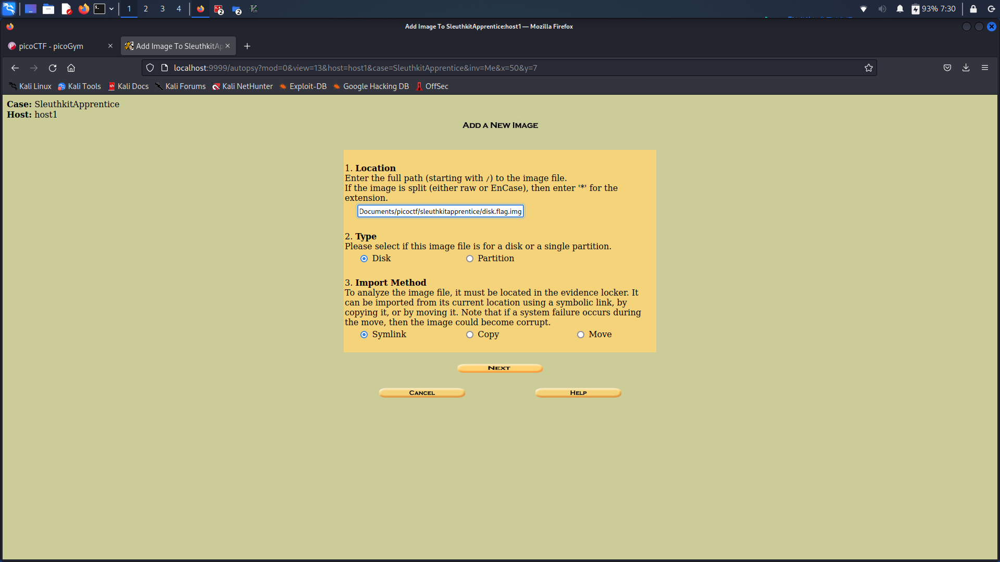
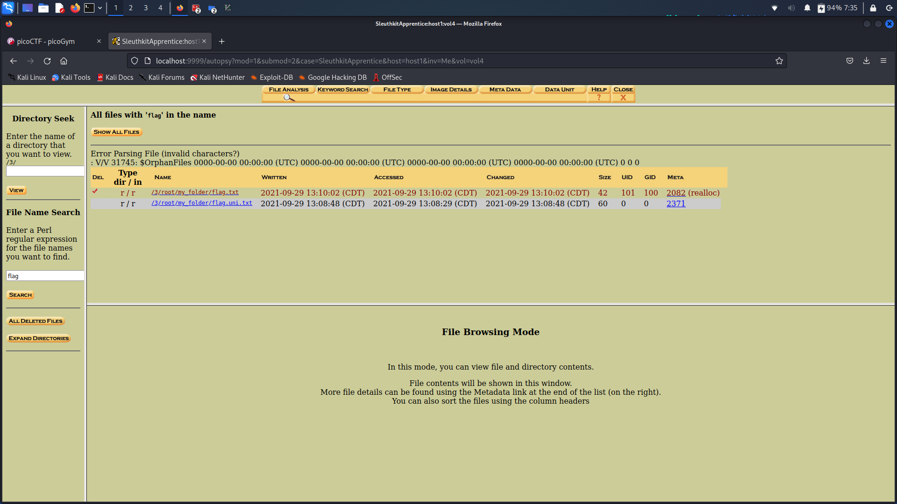
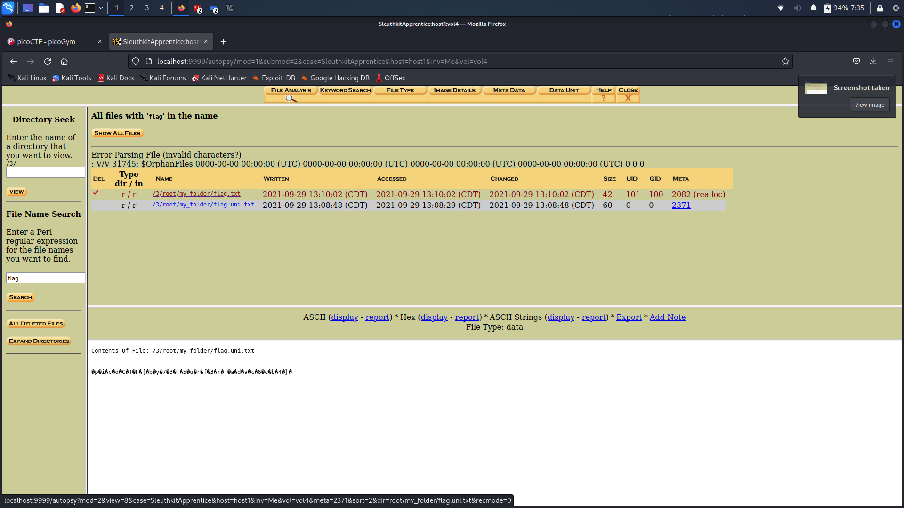

# **Challenge:** SleuthkitApprentice


### **Category:** [Forensics](../)
### **Point Value:** 200
### **Author:** LT 'syreal' Jones
<br>

## **Description:**
Download this disk image and find the flag. Note: if you are using the webshell, download and extract the disk image into /tmp not your home directory.  
  
  Download compressed disk [image](https://artifacts.picoctf.net/c/335/disk.flag.img.gz) [^1]

# **Write-Up:**
Started by setting up a new investigation in Autopsy - Im was using Kali Linux at the time so it was already included
  
  
You do this by clicking on new Case and following the promts until you're asked to include a disk image.
  
  
Adding the Disk image here:  

  
  
Here we are presented with the disk's partition information:  

  

Now I had started with the first partition and did an file name search for 'flag'.  I'll just show the process for partition 3 where I eventually found the flag:  
Select Partition 3:  

  

Clicking on 'details' we and then doing  a flie name search, under the 'File Analysis' tab, we come up with this:  
```
r / r	   	/3/root/my_folder/flag.txt
r / r	   	/3/root/my_folder/flag.uni.txt
``` 	  	

  

Opening up flag.txt, we can see there is just two numbers in there.  Nothing really interesting:  

  

Now looking at flag.uni.txt, we see what appears to be unicode characters. Maybe this is the flag, encoded in some format?:
  

I started by exporting the flag.uni.txt file and opening it up using mouspad on my machine:  

  

Once opened it defaulted to UTF16LE and just by changing it to UTF16BE encoding, I got the flag:  
  


# **FLAG:** 
```
picoCTF{by73_5urf3r_11b94644}
```

[^1]: Included links to the source code may be out of date as they were what I recorded during the competition, and may be different now.