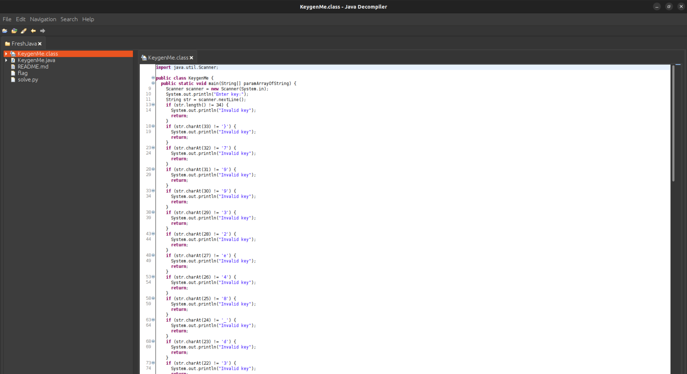
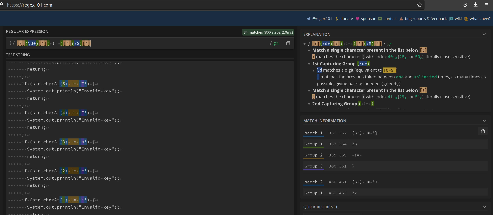
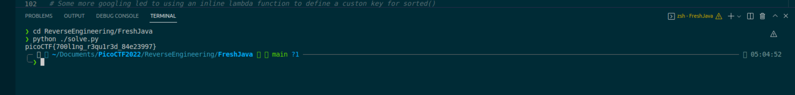

# **Challenge:** FreshJava


### **Category:** [ReverseEngineering](../)
### **Point Value:** 200
### **Author:** LT 'syreal' Jones
<br>

## **Description:**
Can you get the flag? Reverse engineer this [Java program](https://artifacts.picoctf.net/c/212/KeygenMe.class).[^1] [local](./KeygenMe.class)  

# **Write-Up:**
  
Knowing that I needed a way to extract java source code from the .class file, I googled around and found [jd-gui](http://java-decompiler.github.io/).  
After downloading and opening the KeygenMe.class file this is what we find:  
  
  
I went ahead and copied the decompiled source code into a new [KeygenMe.java](./KeygenMe.java) file.  Got rid of the commemnts that were from jd-gui and this is what we end up with:  

```java
 import java.util.Scanner;
 
 public class KeygenMe {
   public static void main(String[] paramArrayOfString) {
     Scanner scanner = new Scanner(System.in);
     System.out.println("Enter key:");
     String str = scanner.nextLine();
     if (str.length() != 34) {
       System.out.println("Invalid key");
       return;
     } 
     if (str.charAt(33) != '}') {
       System.out.println("Invalid key");
       return;
     } 
     /**
        Full source in KeygenMe.java - edited out for space
     **/
```  

Looking through the source we can see that it takes in a string argument, that it then looks at each individual character to determin if the string is a valid 'flag.'  We can tell this as at the end of the file we can see this here:

```java
     if (str.charAt(7) != '{') {
       System.out.println("Invalid key");
       return;
     } 
     if (str.charAt(6) != 'F') {
       System.out.println("Invalid key");
       return;
     } 
     if (str.charAt(5) != 'T') {
       System.out.println("Invalid key");
       return;
     } 
     if (str.charAt(4) != 'C') {
       System.out.println("Invalid key");
       return;
     } 
     if (str.charAt(3) != 'o') {
       System.out.println("Invalid key");
       return;
     } 
     if (str.charAt(2) != 'c') {
       System.out.println("Invalid key");
       return;
     } 
     if (str.charAt(1) != 'i') {
       System.out.println("Invalid key");
       return;
     } 
     if (str.charAt(0) != 'p') {
       System.out.println("Invalid key");
       return;
     } 
     System.out.println("Valid key");
   }
 }
``` 
That looks like the start of a picoCTF{ flag string.  Now I originally started to copy the string manually but decided to use the opportunity to learn some RegEx, and see if I can use that and python to extract the flag faster.  Using the website (https://regex101.com/), I was able to experiment and finally came up with a regex string that would select just the individual characters that make up the flag and their position in the string. 
```regex
[(](\d+)[)]( != )['](\S)[']
```


    

Looking at the screenshot you can see that regex searches through the entire file, and returns just the position integer(highlighted in green) and the flag character(highlighted in purple).  Now that I had a Regex string to parse out the data I needed, i started created [solve.py](./solve.py)] to use the regex and spit out the flag.

```python
# import the regex stuff
import re

# open the KeygenMe.Java file and read it in
with open('./KeygenMe.java') as f:
    lines = f.readlines()

# now we run out regex Magic and get all of the flag string/position pairs    
x = re.findall(r"[(](\d+)[)]( != )['](\S)[']",str(lines))

# I knew there had to be a way to sort that list and found [this](https://docs.python.org/3/library/functions.html#sorted) in the python docs
# Some more googling led to using an inline lambda function to define a custon key for sorted()
x = sorted(x, key=lambda pos: int(pos[0]))

outText = '' # string to hold the flag
for l in x:
 outText += l[2] # extract out the flag characters
print(outText) # display the flag to the console
```  
  
Running the script we get our flag!  
  
  
picoCTF{700l1ng_r3qu1r3d_84e23997}

# **FLAG:** 
``` 
picoCTF{700l1ng_r3qu1r3d_84e23997}
```

[^1]: Included links to the source code may be out of date as they were what I recorded during the competition, and may be different now.