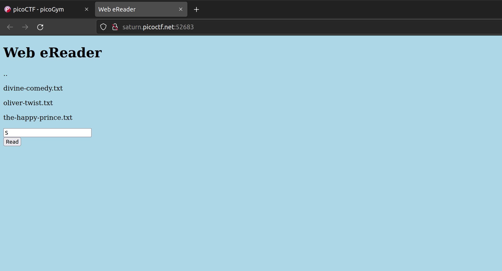
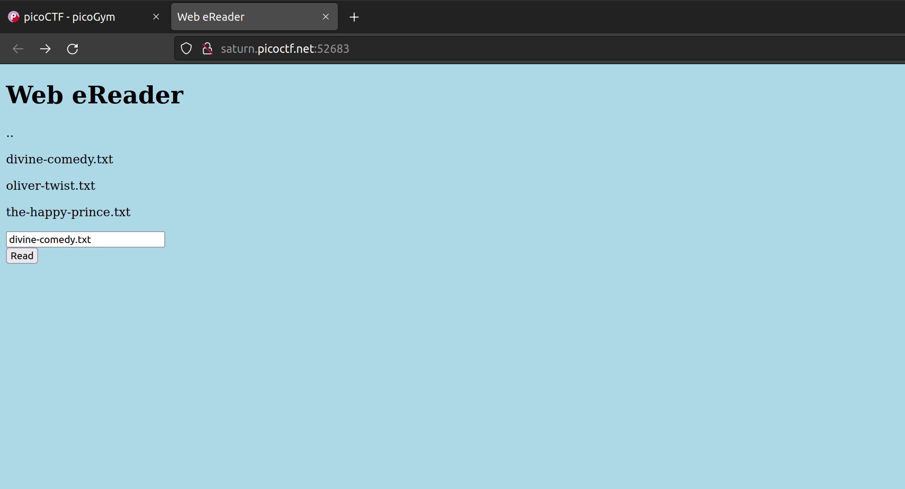
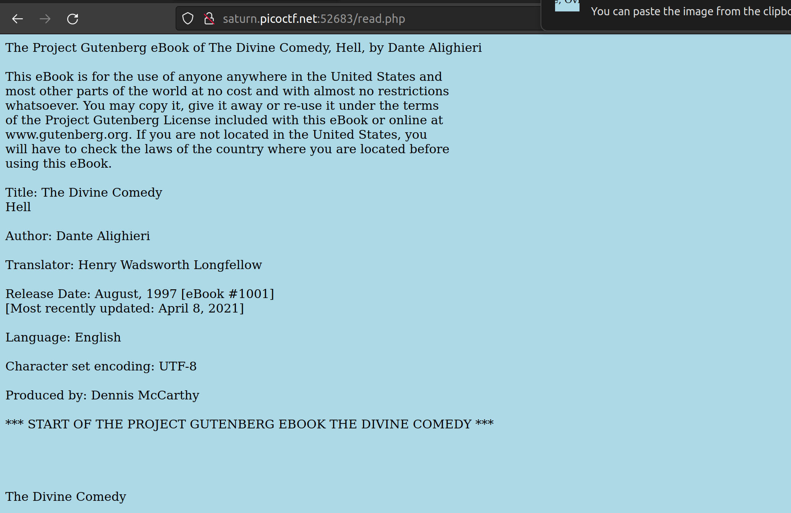
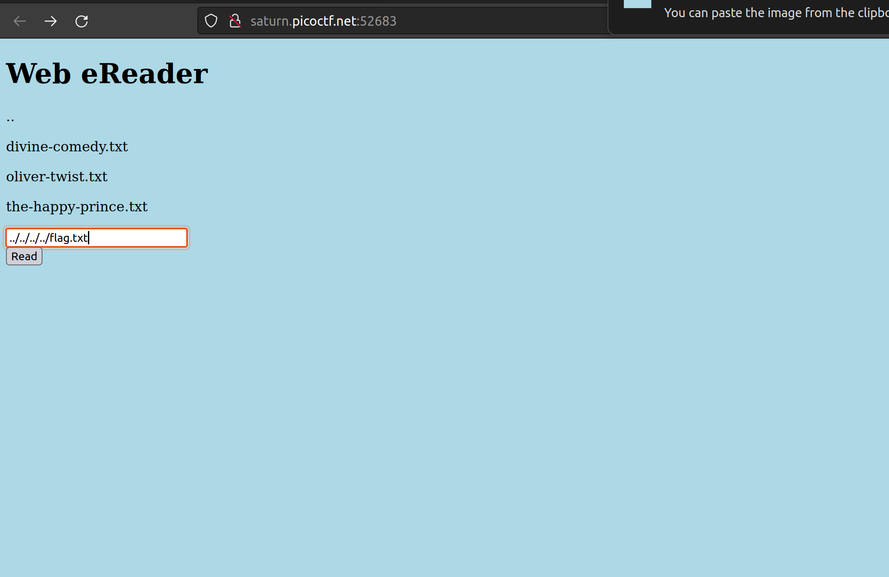
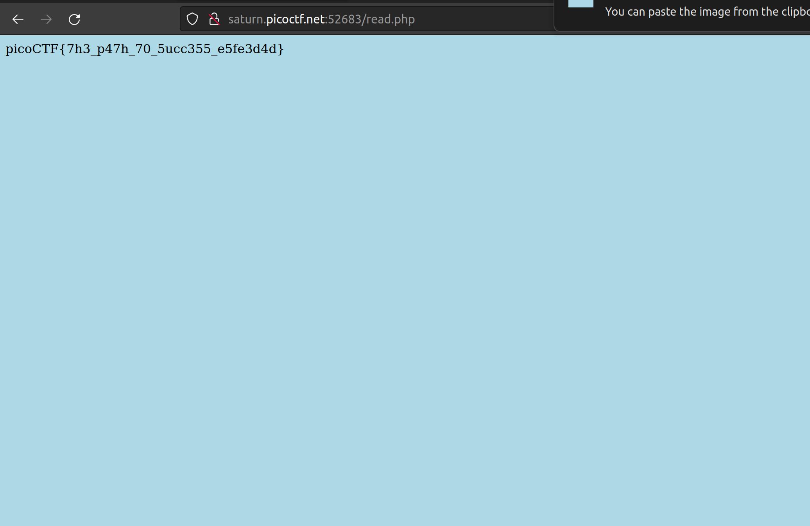

# **Challenge:** ForbiddenPaths


### **Category:** [WebExploitation](../)
### **Point Value:** 200
### **Author:** Author: LT 'syreal' Jones
<br>

## **Description:**
Can you get the flag? Here's the [website](http://saturn.picoctf.net:52472/)[^1]. We know that the website files live in /usr/share/nginx/html/ and the flag is at /flag.txt but the website is filtering absolute file paths. Can you get past the filter to read the flag?


# **Write-Up:**
Upon first glance at this challenge between the name, seeing the .. on the site and given we were supplied with the path where the site lives on the server;  I already had an idea of how to complete the challenge.  But let work through it:  

Lets start by taking a look at the website:  



It looks like we have a textbox with a button that will allow us to "read" a file.
Let's test it out by adding one of the provided story names:  
  



So we know that we can enter in file names to 'read' them.  Now looking at the information given we can figure out we need to go up 4 levels in the directory tree to get to the root aka '/'  

To do that we can just enter:  
```
../../../../flag.txt 
```  
into the textbox and hit the read button.  

  
  

and BOOM got the flag!  



# **FLAG:** 
```
picoCTF{7h3_p47h_70_5ucc355_32e3a320}
```

[^1]: Included links to the source code may be out of date as they were what I recorded during the competition, and may be different now.