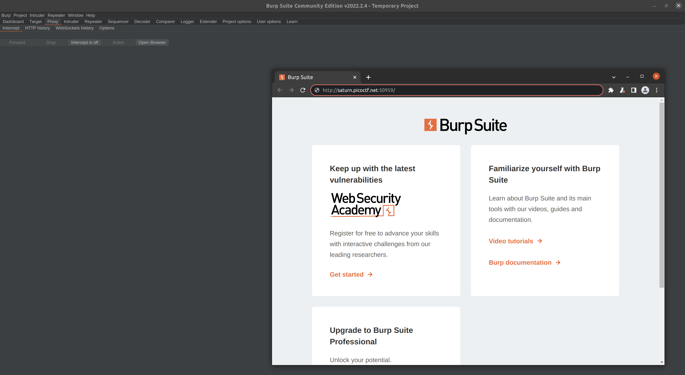
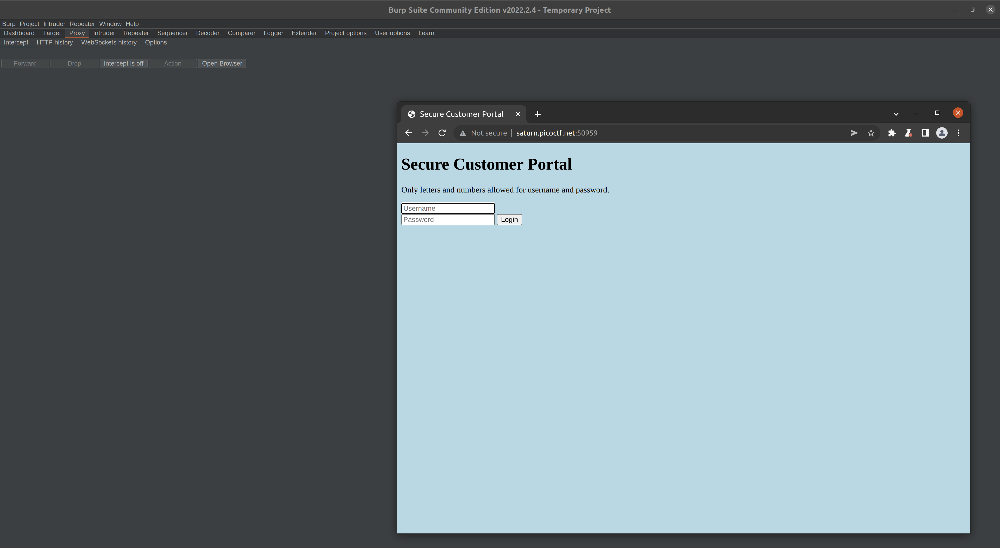
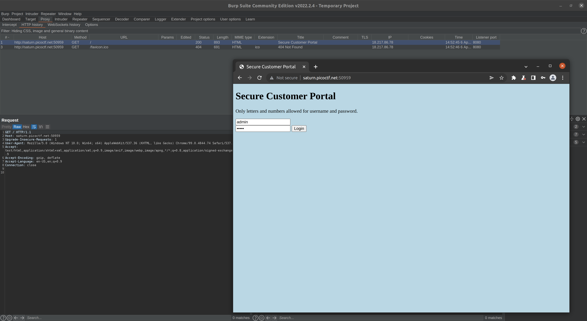
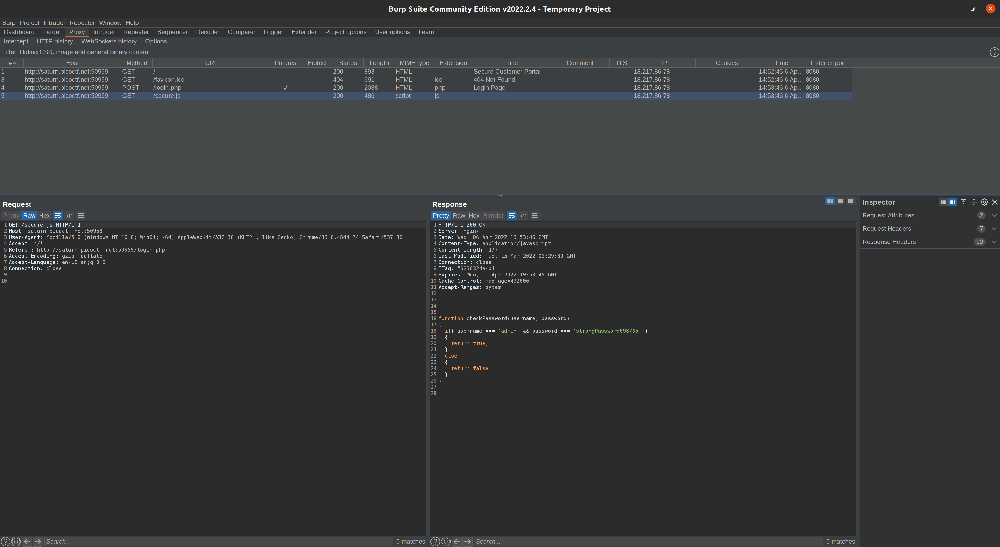
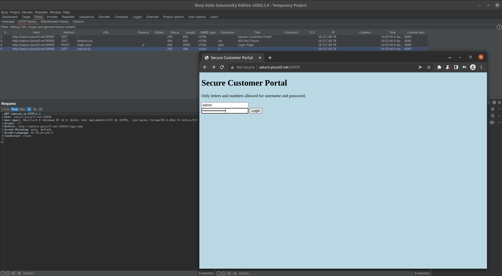
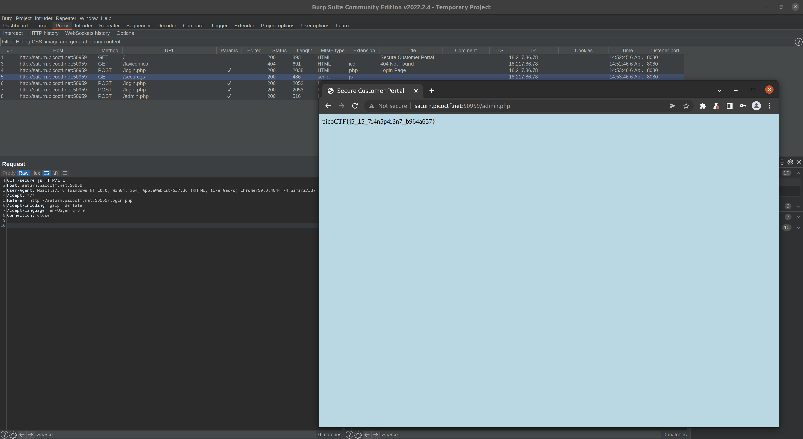

# **Challenge:** Local Authority

### **Category:** [Web Exploitation](../)
### **Point Value:** 100
### **Author:** LT 'SYREAL' JONES
 

## **Description:**
Can you get the flag?  Go to this [website](http://saturn.picoctf.net:50959/)[^1] and see what you can discover.

using burpsuite we find this in the response when trying to log in:

function checkPassword(username, password)
{
  if( username === 'admin' && password === 'strongPassword098765' )
  {
    return true;
  }
  else
  {
    return false;
  }
}

That should be the username and pw:
Using that we log in and get our flag:

# **Write-Up:**
Let's start by opening up Burpsuite, going to the proxy tab and opening the browser:  

Next let's open the site and see what loads:  
  

We're being presented with a login screen, so lets just try using 'admin/admin' and see what happens:  
   

We are just presented with a Login failed message, so lets look to see what Burpsuite caught for us.  Looking at the results we can see there area  few files that were accessed on the site, and looking at secure.js, we can see what appears to be a username/password combo in the checkPassword function, in plain text:  

   

Entering those credentials into the pages login prompt:  
 
  
And we are presented with our flag!  

 

# **FLAG:** 
picoCTF{j5_15_7r4n5p4r3n7_b964a657}

[^1]: Included links to the source code may be out of date as they were what I recorded during the competition, and may be different now.