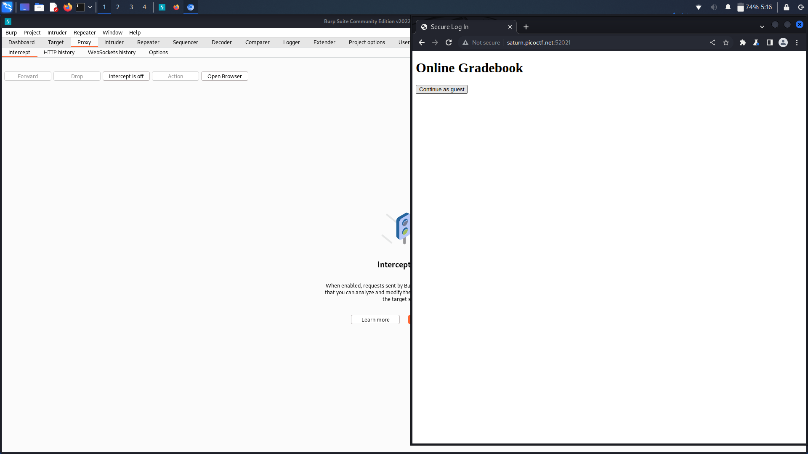
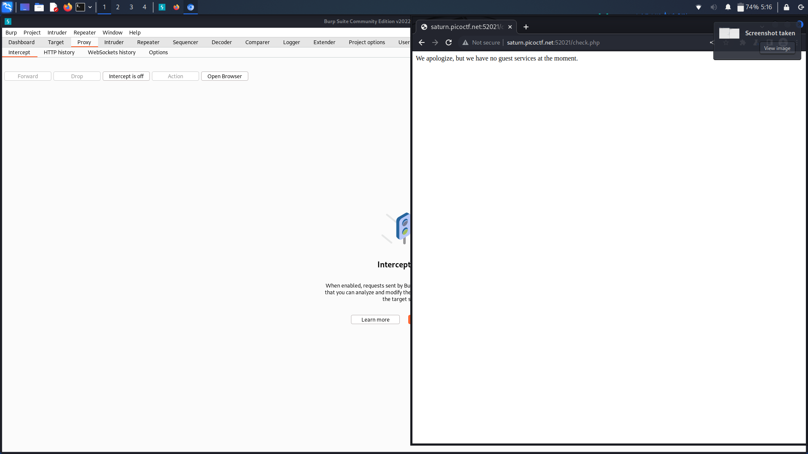
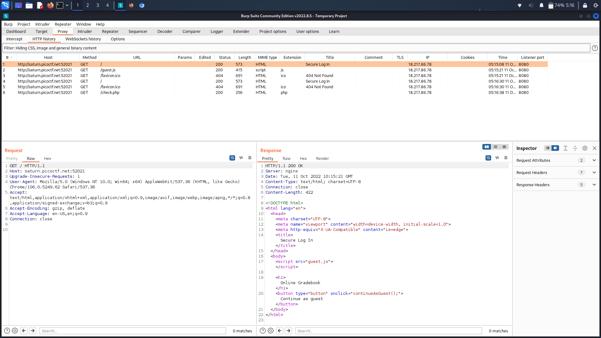
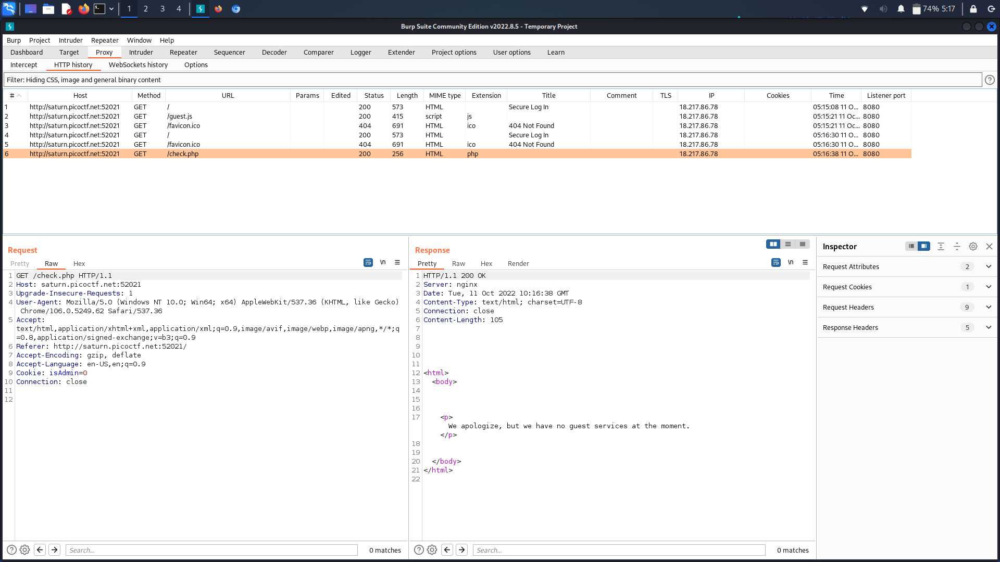
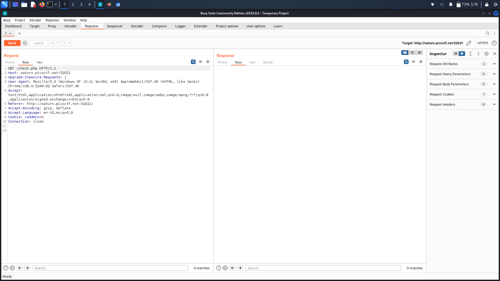
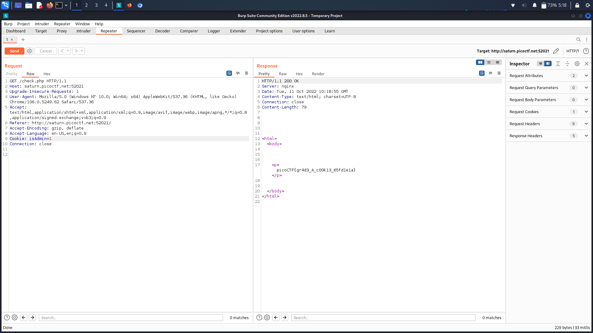

# **Challenge:** PowerCookie


### **Category:** [WebExploitation](../)
### **Point Value:** 200
### **Author:**  LT 'syreal' Jones
<br>

## **Description:**
Can you get the flag? Go to this [website](http://saturn.picoctf.net:63397/)[^1] and see what you can discover.

# **Write-Up:**
Opened using burpsuite: After starting a new project, I went to the 'proxy' tab and opened the BurpSuite Browser.  I then navigated to the website link and this is what I got:  

  

Looking at the site it appears all I can do is try to login as guest.  After clicking the login as guest button, here is what I saw:  

  
  
Now I went back to BurpSuite and opened up the 'HTTP history' tab.  Here you can see the various get requests exchanged between my computer and the site:  

  

Here we can see the exchange that happened once I pressed the "Login as guest' button:  

  
  
Looking at the details we see this http header:  

```
GET /check.php HTTP/1.1
Host: saturn.picoctf.net:63397
Upgrade-Insecure-Requests: 1
User-Agent: Mozilla/5.0 (Windows NT 10.0; Win64; x64) AppleWebKit/537.36 (KHTML, like Gecko) Chrome/95.0.4638.69 Safari/537.36
Accept: text/html,application/xhtml+xml,application/xml;q=0.9,image/avif,image/webp,image/apng,*/*;q=0.8,application/signed-exchange;v=b3;q=0.9
Referer: http://saturn.picoctf.net:63397/
Accept-Encoding: gzip, deflate
Accept-Language: en-US,en;q=0.9
Cookie: isAdmin=0
Connection: close
```  
  
The 'Cookie: isAdmin=0' line was of particular interest, I wondered what would happen if I changed the 0 to a 1 and resent the request?  To try it out I send this request over to BurpSuite's repeater function using keybind(ctrl+r):

  
  
  
I the Changed isAdmin=1 and resent the request, and got back this response:   
  
  

  
And there it is under the response heading, our flag!

# **FLAG:** 
```
picoCTF{gr4d3_A_c00k13_87608ba8}
```

[^1]: Included links to the source code may be out of date as they were what I recorded during the competition, and may be different now.