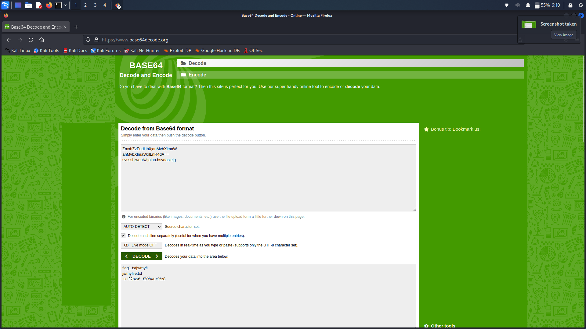

# **Challenge:** RobotoSans


### **Category:** [WebExploitation](../)
### **Point Value:** 200
### **Author:** Mubarak Mikail
<br>

## **Description:**
The flag is somewhere on this web application not necessarily on the website. Find it. Check this out.

http://saturn.picoctf.net:57329/

# **Write-Up:**

Nikto said to check robots.txt
```bash
└─$ nikto -host http://saturn.picoctf.net:57329/ -output ./nikto_results.txt
- Nikto v2.1.6
---------------------------------------------------------------------------
+ Target IP:          18.217.86.78
+ Target Hostname:    saturn.picoctf.net
+ Target Port:        57329
+ Start Time:         2022-10-11 05:50:08 (GMT-5)
---------------------------------------------------------------------------
+ Server: nginx/1.21.6
+ The anti-clickjacking X-Frame-Options header is not present.
+ The X-XSS-Protection header is not defined. This header can hint to the user agent to protect against some forms of XSS
+ The X-Content-Type-Options header is not set. This could allow the user agent to render the content of the site in a different fashion to the MIME type
+ No CGI Directories found (use '-C all' to force check all possible dirs)
+ "robots.txt" contains 2 entries which should be manually viewed.
+ RFC-1918 IP address found in the 'location' header. The IP is "172.16.1.106".
+ OSVDB-630: The web server may reveal its internal or real IP in the Location header via a request to /images over HTTP/1.0. The value is "172.16.1.106".
```  
Used wget to download [robots.txt](./robots.txt) then just 'cat' it to the console:  
```bash
└─$ wget http://saturn.picoctf.net:57329/robots.txt

└─$ cat robots.txt
User-agent *
Disallow: /cgi-bin/
Think you have seen your flag or want to keep looking.

ZmxhZzEudHh0;anMvbXlmaW
anMvbXlmaWxlLnR4dA==
svssshjweuiwl;oiho.bsvdaslejg
Disallow: /wp-admin/
```  
The string ending in double equals is a good indicator that its base64 encoded.  Went to decode it in the console but it ended up looking malformed:  

```bash
└─$ echo 'ZmxhZzEudHh0anMvbXlmaWanMvbXlmaWxlLnR4dA==' | base64 -d
flag1.txt js/myfif�2�זf��R�G�@base64: invalid input
```  
I then decided to just put the original text through an online base64 decoder (https://www.base64decode.org/) and this was the results:  
  
  
```  
flag1.txtjs/myfi
js/myfile.txt
```  
  
With that I decided to navigate to (http://saturn.picoctf.net:57329/js/myfile.txt) to see if it would work and, we got our flag!


  
# **FLAG:** 
```
picoCTF{Who_D03sN7_L1k5_90B0T5_87ccf72a}
```

[^1]: Included links to the source code may be out of date as they were what I recorded during the competition, and may be different now.