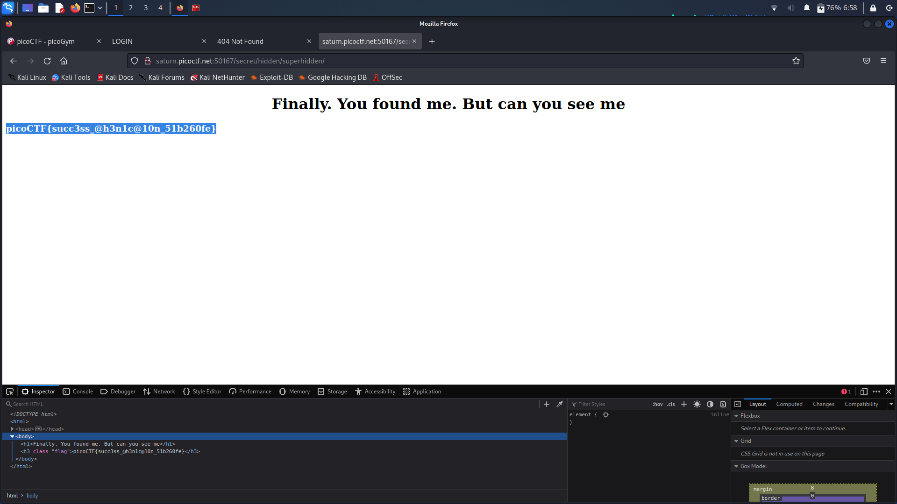

# **Challenge:** Secrets


### **Category:** [WebExploitation](../)
### **Point Value:** 200
### **Author:** Geoffrey Njogu
<br>

## **Description:**
We have several pages hidden. Can you find the one with the flag? The website is running [here](http://saturn.picoctf.net:49810/)[^1].

# **Write-Up:**
Site:  
  

When nothing stuck out in the source code I decided to toss the site and gobuster and see what popped up. Doing so I traced down some hidden directories (lost origin output so recreated today):  

```bash
└─$ gobuster dir -u http://saturn.picoctf.net:50167/ -w /usr/share/wordlists/dirb/big.txt 
===============================================================
Gobuster v3.1.0
by OJ Reeves (@TheColonial) & Christian Mehlmauer (@firefart)
===============================================================
[+] Url:                     http://saturn.picoctf.net:50167/
[+] Method:                  GET
[+] Threads:                 10
[+] Wordlist:                /usr/share/wordlists/dirb/big.txt
[+] Negative Status codes:   404
[+] User Agent:              gobuster/3.1.0
[+] Timeout:                 10s
===============================================================
2022/10/11 06:52:51 Starting gobuster in directory enumeration mode
===============================================================
/secret               (Status: 301) [Size: 169] [--> http://saturn.picoctf.net/secret/]
                                                                                       
===============================================================
2022/10/11 06:54:04 Finished
===============================================================
```  

Opening that [directory](http://saturn.picoctf.net:49810/secret/)[^1] in a web browser got me this:  
  

Looking at its source, in the 'Head' Tag, I saw a reference to hidden/file.css. So I then navigated to (http://saturn.picoctf.net:49810/secret/hidden/) [^1] and once again looking at the code I found a mention of superhidden/login.css:  
  
  

Rinse repeat with (http://saturn.picoctf.net:49810/secret/hidden/superhidden/) [^1]
  
  
Now we can see the flag in the source code below, but another way to view the flag was to select all the test on the webpage:  
  

  
# **FLAG:** 
```
picoCTF{succ3ss_@h3n1c@10n_08de81e4}
```

[^1]: Included links to the source code may be out of date as they were what I recorded during the competition, and may be different now.